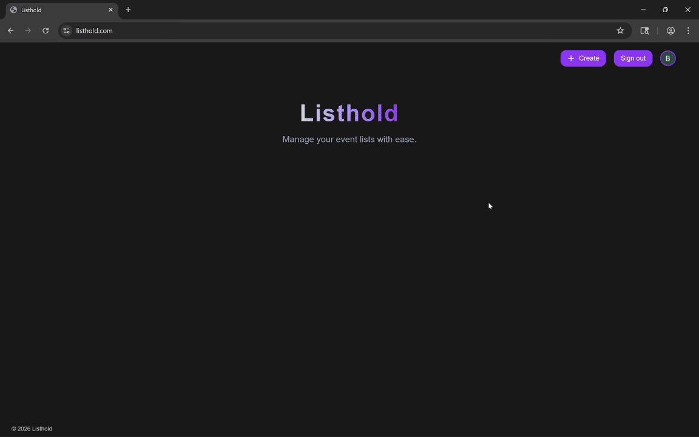
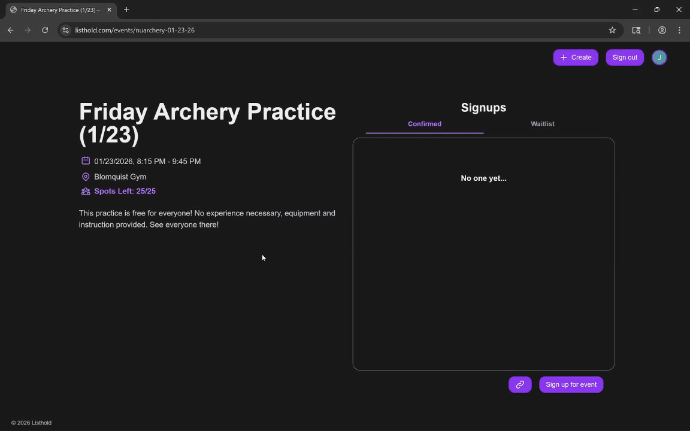
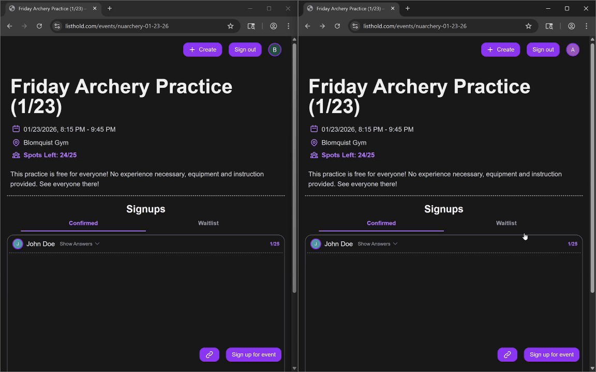
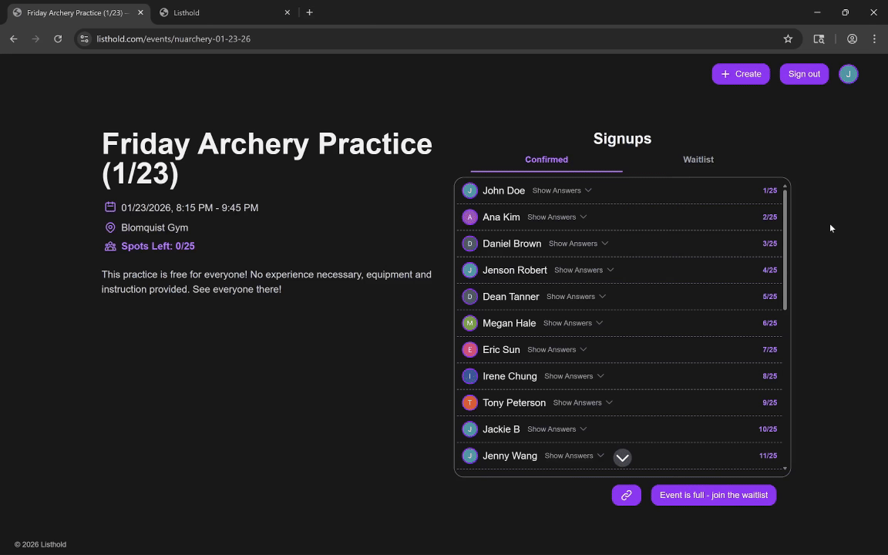
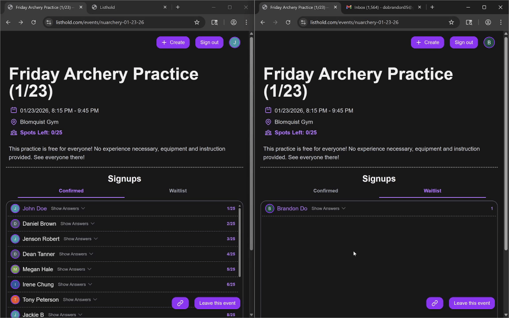

# Listhold

A real-time event management platform designed to make managing event lists, waitlists, and signups effortless for organizers and attendees.

## Demo

Check out the app at **[https://listhold.com](https://listhold.com)**

### Creating an event:



### Signing up for an event:



### Real-time event list:



### Joining a waitlist when event is full:



### Automatic waitlist promotion + email notification:



## Features

### Event Management

- **Create & Organize:** Create events with specific capacities, descriptions, times, and locations.
- **Custom Questionnaires:** Organizers can attach custom questionnaires (e.g., "Do you need parking?", "Are you a new member of our club?") to the signup process.

### Real-Time Rosters and Automated Waitlists

- **Live Updates:** Rosters update globally in real-time. Users can see exactly how many spots are left and who else has signed up without refreshing the page.
- **Smart Waitlists:** When an event fills up, users can join a waitlist.
- **Auto-Promotion:** If a confirmed attendee cancels via the app, the system automatically confirms the next person on the waitlist and sends them an email notification.

### Security & Access

- **Google Authentication:** Secure sign-in via Google OAuth.
- **Data Privacy:** Uses **Row Level Security (RLS)** to enforce granular access control:
  - **Example:** Sensitive answers to questions marked as "private" are only visible to the event organizer and the attendee themselves.

## Tech Stack

- **Frontend:** Next.js 16 (App Router), React 19, TypeScript, Tailwind CSS 4, Lucide React
- **Backend:** Supabase (PostgreSQL, Auth, Deno Edge Functions)
- **Database:** PostgreSQL (with RLS, Triggers, Functions)
- **Email:** SMTP2GO
- **Hosting:** Vercel

## Project Structure

- **`/src`**: Frontend source code (Next.js App Router, components, styling, hooks).
- **`/supabase`**: Backend infrastructure (Edge Functions, SQL migrations, local configuration).

## Getting Started

To get this app running locally, follow these instructions:

### Prerequisites

- Node.js v20+
- Docker (for local Supabase development)

### Installation

1.  **Clone the repository**

    ```bash
    git clone https://github.com/brndn-do/listhold.git
    cd listhold
    ```

2.  **Install dependencies**

    ```bash
    npm install
    ```

3.  **Start local Supabase**

    Make sure Docker is running, then:

    ```bash
    npx supabase start
    npx supabase status # this will print API keys
    ```

    You can also view the local dashboard at `http://127.0.0.1:54323`.

4.  **Configure Environment Variables**

    Copy the example file:

    ```bash
    cp .env.example .env
    ```

    Open `.env` and fill in the values:
    - **Supabase Keys:** Copy `API URL` and `anon key` from the output of the previous step (or run `npx supabase status`).
    - **Google Keys:** Provide your Google Cloud OAuth Client ID and Secret.

    _(Optional) To enable email notifications:_

    ```bash
    cp ./supabase/functions/.env.example ./supabase/functions/.env
    ```

    Open `./supabase/functions/.env` and fill in your `SMTP2GO_API_KEY` and `FROM_EMAIL`.

5.  **Initialize Database & Functions**

    In a separate terminal window, run:

    ```bash
    # Apply database migrations
    npx supabase migration up

    # Generate TypeScript types from your schema
    npm run types

    # Start Edge Functions (keep this terminal running)
    npx supabase functions serve
    ```

6.  **Run the Frontend**

    In another terminal window:

    ```bash
    npm run dev
    ```

    Visit `http://localhost:3000` to see the app.

## Documentation

For deeper insight into the design decisions:

- [**API Documentation**](docs/API.md) - API reference for serverless Edge Functions.
- [**Database Schema**](docs/DB_SCHEMA.md) - Detailed Entity-Relationship breakdown and RLS policies.
- [**Routing Architecture**](docs/ROUTING_SCHEMA.md) - App Router layout.
- [**User Scenarios**](docs/SCENARIO.md) - Comprehensive user journey maps and persona definitions.

## Contribution and Inquiries

If you are interested in contributing, or have any inquiries, please contact: **dobrandon05@gmail.com**

## License

This project is licensed under the [MIT License](/LICENSE).
